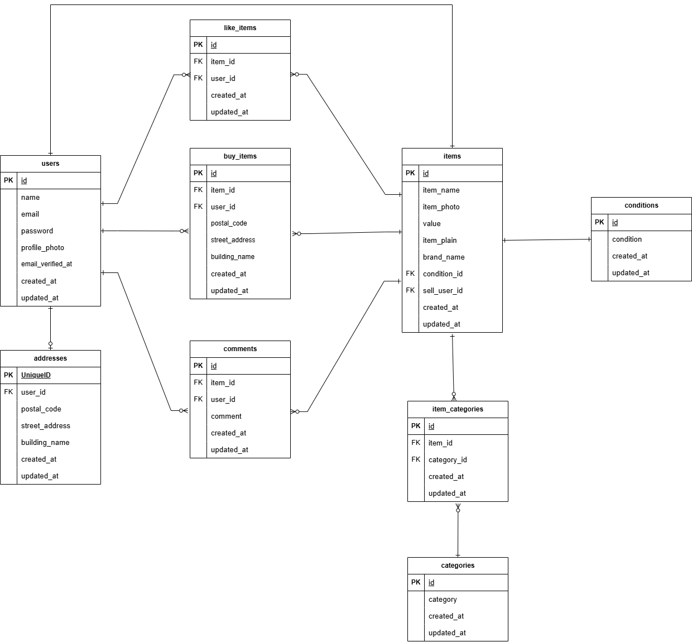

# COACHTECHフリマ

## アプリケーション概要

COACHTECHフリマは、商品の出品・購入・お気に入り登録・コメント機能を備えたフリマアプリです。

### 主な機能

- 会員登録
- ログイン / ログアウト
- メール認証
- プロフィール編集
- 商品一覧表示
- 商品詳細表示
- 商品出品
- 商品購入
- お気に入り登録
- コメント投稿
- 商品検索

---

## 環境構築

### Dockerビルド

Dockerコンテナを起動します。

```bash
docker compose up -d --build
```

---

### Laravel環境構築

PHPコンテナへ入ります。

```bash
docker compose exec php bash
```

Composerパッケージをインストールします。

```bash
composer install
```

.envファイルを用意する
(※ 案件参画者にもらう)

アプリケーションキーを生成します。

```bash
php artisan key:generate
```

マイグレーションとシーディングを実行します。

```bash
php artisan migrate:fresh --seed
```

ストレージリンクを作成します。

```bash
php artisan storage:link
```

下記のリンクにアクセスすることで操作できます。

```bash
http://localhost
```

---

## Dockerコンテナ構成

| コンテナ名 | 説明                               |
| ---------- | ---------------------------------- |
| nginx      | Webサーバー                        |
| php        | Laravelアプリケーション実行環境    |
| mysql      | データベース                       |
| phpMyAdmin | データベース管理ツール             |
| mailhog    | メール送信確認ツール               |
| selenium   | Laravel Dusk実行用ブラウザコンテナ |

---

## 使用技術（実行環境）

- PHP 8.x
- Laravel 8.x
- MySQL 8.0.26
- Nginx 1.21.1
- Docker
- phpMyAdmin
- MailHog
- Laravel Fortify
- Laravel Dusk

---

## ER図

作成したER図を添付



---

## URL

### 開発環境

http://localhost

### phpMyAdmin

http://localhost:8080

### MailHog

http://localhost:8025

---

## テスト実行

### PHPUnitテスト

.env.testingと.env.duskのSTRIPE_SECRETの値を.envを参考にして入力してください。

テスト用DBを作成します。
(Mysqlコンテナ内)

```sql
mysql -u root -p (パスワードはroot)
CREATE DATABASE laravel_test;
```

テストDBへマイグレーションとシーディングを実行します。
(phpコンテナ内)

```bash
php artisan migrate:fresh --env=testing --seed --force
```

Featureテストを実行します。
(phpコンテナ内)

```bash
php artisan test
```

### Duskテストを実行します。

(phpコンテナ内)

```bash
php artisan dusk
```


特定のテストのみ実行する場合
(phpコンテナ内)

```bash
php artisan test --filter LoginTest
```

---

## テスト用アカウント

### ユーザー1

メールアドレス

```text
user1@example.com
```

パスワード

```text
password
```

### ユーザー2

メールアドレス

```text
user2@example.com
```

パスワード

```text
password
```

---

## 備考

メール認証機能は MailHog を利用しています。

認証メールは以下のURLから確認できます。

http://localhost:8025
